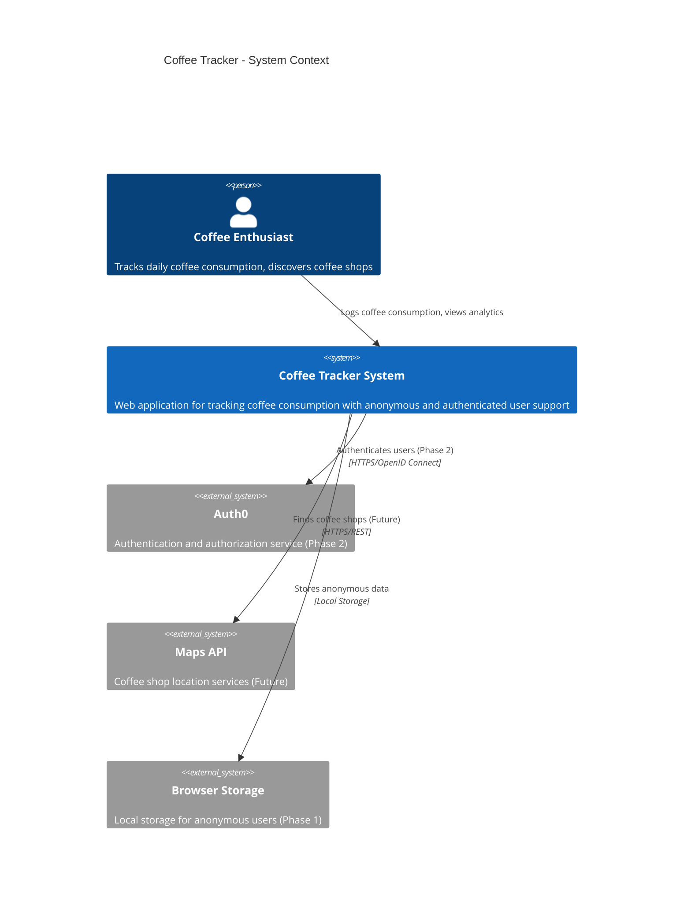
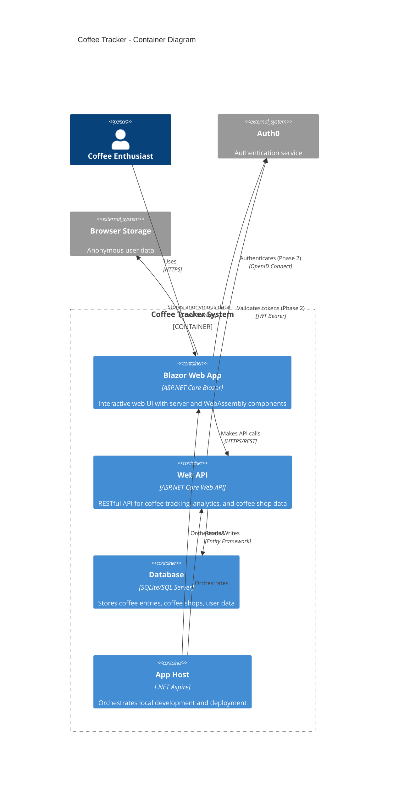
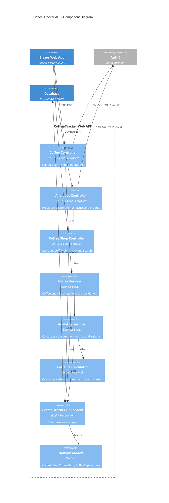
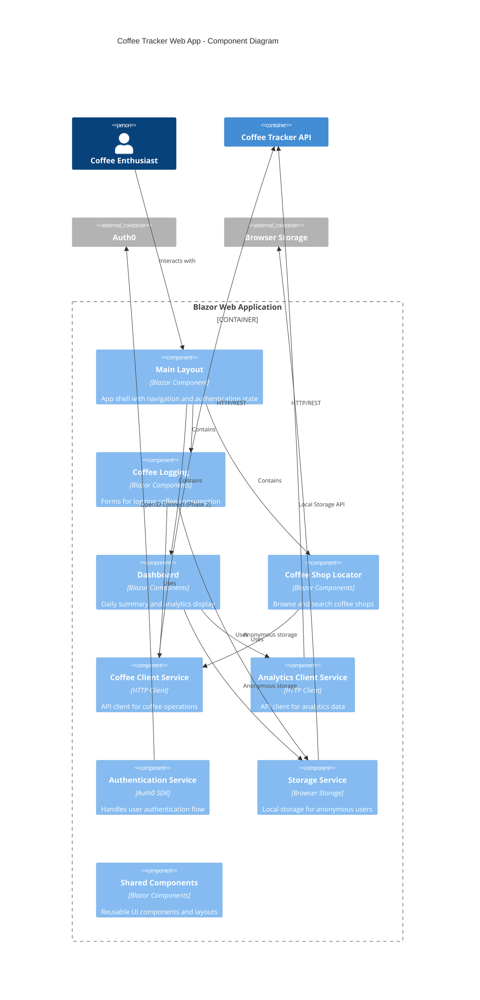

# Coffee Tracker - Application Architecture

**Version:** 1.0  
**Date:** July 10, 2025  
**Status:** Epic 1 - Domain Models (In Progress)  
**Last Updated:** After Epic 1 completion  

---

## 📋 Document Overview

This document provides the technical architecture overview and developer onboarding guide for the Coffee Tracker application. It includes C4 model diagrams, system design decisions, and comprehensive developer guidance.

**🔄 Living Document**: This architecture document is updated at the end of each epic to reflect the current state of the application.

---

## 🏗️ System Architecture Overview

Coffee Tracker is a .NET Aspire application built with a modern, cloud-native architecture focusing on anonymous user MVP with future authentication capabilities.

### 🎯 Current Phase: Phase 1 - Anonymous User MVP
- **Goal**: Rapid deployment of core coffee tracking features
- **Users**: Anonymous users (no authentication required)
- **Data Persistence**: 24-hour browser storage for anonymous users
- **Focus**: Core functionality with clean, extensible architecture

---

## 📊 C4 Model Diagrams

### Level 1: System Context Diagram



### Level 2: Container Diagram



### Level 3: Component Diagram - Web API



### Level 3: Component Diagram - Blazor Web App



---

## 🎯 Architectural Decisions

### ADR-001: Anonymous-First MVP Approach
- **Status**: Accepted
- **Decision**: Build Phase 1 without authentication to accelerate time-to-market
- **Rationale**: Faster user feedback, simpler initial architecture, easier testing
- **Consequences**: 24-hour data persistence limit, migration strategy needed for Phase 2

### ADR-002: .NET Aspire for Orchestration
- **Status**: Accepted  
- **Decision**: Use .NET Aspire for local development and cloud deployment
- **Rationale**: Modern cloud-native development, excellent local dev experience
- **Consequences**: Team needs to learn Aspire, requires .NET 8+

### ADR-003: Blazor Interactive Auto Render Mode
- **Status**: Accepted
- **Decision**: Use Blazor Server + WebAssembly hybrid approach
- **Rationale**: Best performance and user experience, flexible deployment
- **Consequences**: More complex than pure server or client mode

### ADR-004: SQLite for Development, SQL Server for Production
- **Status**: Accepted
- **Decision**: SQLite for local development, SQL Server for production
- **Rationale**: Easy local development, production scalability
- **Consequences**: Need to ensure EF Core compatibility across databases

### ADR-005: TDD with AI Assistance
- **Status**: Accepted
- **Decision**: Test-Driven Development enhanced with GitHub Copilot
- **Rationale**: High code quality, comprehensive testing, accelerated development
- **Consequences**: Requires discipline, AI prompts need maintenance

---

## 🔧 Technology Stack

### Frontend
- **Framework**: ASP.NET Core Blazor (.NET 8)
- **Render Mode**: Interactive Auto (Server + WebAssembly)
- **Styling**: CSS with Bootstrap (customizable)
- **State Management**: Blazor component state + browser storage

### Backend
- **Framework**: ASP.NET Core Web API (.NET 8)
- **Authentication**: Auth0 with JWT Bearer tokens (Phase 2)
- **Authorization**: Role-based with Auth0 claims (Phase 2)
- **API Documentation**: OpenAPI/Swagger

### Data Layer
- **ORM**: Entity Framework Core 8
- **Database**: SQLite (development), SQL Server (production)
- **Migrations**: EF Core Code First migrations
- **Caching**: In-memory caching for analytics

### Development & Testing
- **Testing**: xUnit, bUnit, ASP.NET Core TestHost
- **Mocking**: Moq framework
- **Code Coverage**: Coverlet
- **Static Analysis**: SonarAnalyzer, EditorConfig

### Infrastructure
- **Orchestration**: .NET Aspire
- **Deployment**: Azure Container Apps (planned)
- **CI/CD**: GitHub Actions (planned)
- **Monitoring**: Application Insights (planned)

---

## 🗂️ Project Structure

```
CoffeeTrackerTDD/
├── 📁 architecture/                           # Documentation and design
│   ├── 📄 Initial-PRD.md                     # Product requirements
│   ├── 📄 Development-Plan.md                # Epic planning and progress
│   ├── 📄 Architecture.md                    # This document
│   ├── 📄 Epic-*.md                          # Detailed epic specifications
│   └── 📁 github-issues/                     # GitHub issue templates
│
├── 📁 infrastructure/                         # .NET Aspire orchestration
│   ├── 📁 CoffeeTracker.AppHost/             # Aspire application host
│   └── 📁 CoffeeTracker.ServiceDefaults/     # Shared service configurations
│
├── 📁 src/                                   # Production code
│   ├── 📁 CoffeeTracker.Api/                 # Web API backend
│   │   ├── 📁 Controllers/                   # API controllers
│   │   ├── 📁 Models/                        # Domain models and DTOs
│   │   ├── 📁 Data/                          # DbContext and migrations
│   │   ├── 📁 Services/                      # Business logic services
│   │   └── 📄 Program.cs                     # API startup configuration
│   │
│   └── 📁 CoffeeTracker.Web/                 # Blazor web application
│       ├── 📁 CoffeeTracker.Web/             # Server-side Blazor
│       │   ├── 📁 Components/                # Blazor components
│       │   ├── 📁 Services/                  # Client-side services
│       │   └── 📄 Program.cs                 # Web app configuration
│       └── 📁 CoffeeTracker.Web.Client/      # Client-side Blazor (WASM)
│
├── 📁 test/                                  # Test projects
│   ├── 📁 CoffeeTracker.Api.Tests/           # API unit and integration tests
│   └── 📁 CoffeeTracker.Web.Tests/           # Web/Blazor component tests
│
├── 📁 data/                                  # SQLite database location
├── 📁 docs/                                  # Additional documentation
└── 📁 scripts/                               # Build and deployment scripts
```

---

## 👨‍💻 Developer Onboarding Guide

### 🚀 Quick Start (30 minutes)

#### 1. Prerequisites Setup
```bash
# Install .NET 8 SDK
# Download from: https://dotnet.microsoft.com/download/dotnet/8.0

# Install .NET Aspire workload
dotnet workload update
dotnet workload install aspire

# Install Entity Framework tools
dotnet tool install --global dotnet-ef

# Verify installations
dotnet --version                    # Should be 8.0+
dotnet workload list               # Should include aspire
dotnet ef --version                # Should be 8.0+
```

#### 2. Repository Setup
```bash
# Clone repository
git clone <repository-url>
cd CoffeeTrackerTDD

# Restore packages
dotnet restore

# Build solution
dotnet build

# Run tests to verify setup
dotnet test
```

#### 3. Running the Application
```bash
# Option 1: Using .NET Aspire (Recommended)
dotnet run --project infrastructure/CoffeeTracker.AppHost

# This will open:
# - Aspire Dashboard: https://localhost:15888
# - Web App: https://localhost:7001  
# - API: https://localhost:7002

# Option 2: Individual projects (for debugging)
# Terminal 1 - API
dotnet run --project src/CoffeeTracker.Api

# Terminal 2 - Web App  
dotnet run --project src/CoffeeTracker.Web/CoffeeTracker.Web
```

### 🧪 Development Workflow

#### TDD with AI Assistance
1. **📋 Pick an Issue**: Start with `architecture/github-issues/Issue-001-*`
2. **🤖 Use AI Prompt**: Copy the prompt from the issue file
3. **🔴 Red Phase**: Write failing tests first
4. **🟢 Green Phase**: Write minimal code to pass
5. **🔄 Refactor**: Clean up while keeping tests green
6. **✅ Validate**: Check all acceptance criteria

#### Example TDD Cycle
```bash
# 1. Create a failing test
# In test/CoffeeTracker.Api.Tests/Models/CoffeeEntryTests.cs

# 2. Run tests to see failure
dotnet test --filter "CoffeeEntryTests"

# 3. Implement minimal code to pass
# In src/CoffeeTracker.Api/Models/CoffeeEntry.cs

# 4. Run tests to see green
dotnet test --filter "CoffeeEntryTests"

# 5. Refactor if needed
# 6. Run all tests
dotnet test
```

### 🔧 Development Tools

#### Recommended IDE Setup
- **Visual Studio 2022** (Windows) or **VS Code** (Cross-platform)
- **GitHub Copilot** extension for AI assistance
- **C# extensions** and **Blazor support**
- **Test Explorer** for running tests

#### Useful Commands
```bash
# Build and test
dotnet build
dotnet test
dotnet test --collect:"XPlat Code Coverage"

# Database operations
dotnet ef migrations add MigrationName --project src/CoffeeTracker.Api
dotnet ef database update --project src/CoffeeTracker.Api

# Add packages
dotnet add package <PackageName> --project <ProjectPath>

# Clean and rebuild
dotnet clean
dotnet build
```

### 📊 Code Quality Standards

#### Testing Requirements
- **Unit Tests**: >90% code coverage required
- **Integration Tests**: API endpoints and database operations
- **Component Tests**: Blazor components using bUnit
- **TDD Approach**: Tests written before implementation

#### Code Standards
- **Clean Code**: SOLID principles, readable variable names
- **XML Documentation**: All public members documented
- **Error Handling**: Proper exception handling and logging
- **Validation**: Input validation on all user inputs

### 🐛 Troubleshooting

#### Common Issues

**Aspire won't start**
```bash
# Ensure Aspire workload is installed
dotnet workload install aspire

# Check for port conflicts
netstat -an | findstr "15888"
```

**Database issues**
```bash
# Delete and recreate database
rm data/coffee-tracker.db
dotnet ef database update --project src/CoffeeTracker.Api
```

**Test failures**
```bash
# Clean and rebuild
dotnet clean
dotnet build
dotnet test --no-build
```

#### Getting Help
- **Architecture Questions**: Review this document and PRD
- **Implementation Help**: Use GitHub issue prompts with Copilot
- **Code Issues**: Check existing tests for patterns
- **Build Problems**: Verify prerequisites and clean/rebuild

---

## 🔄 Architecture Evolution

### Current State (Epic 1)
- ✅ Project structure and .NET Aspire setup
- 🚧 Domain models and database foundation
- ⏳ Core API endpoints
- ⏳ Blazor UI components

### Planned Evolution

#### Epic 2-4: Core MVP Features
- Coffee logging API endpoints
- Coffee shop data and search
- Blazor UI with responsive design
- Analytics and reporting

#### Epic 5-7: Production Readiness
- Mobile-responsive PWA
- Azure deployment infrastructure
- Monitoring and observability
- Performance optimization

#### Phase 2: Authentication & Users
- Auth0 integration
- User profile management
- Historical data persistence
- Role-based features

#### Phase 3-4: Advanced Features
- Social features and reviews
- Advanced analytics with ML
- Recommendation engine
- Mobile applications

### Architecture Updates
This document will be updated after each epic completion to reflect:
- New components and services added
- Updated C4 diagrams
- New architectural decisions
- Technology stack changes
- Performance and security improvements

---

## 📚 Learning Resources

### .NET Aspire
- [Official Documentation](https://learn.microsoft.com/en-us/dotnet/aspire/)
- [Aspire Samples](https://github.com/dotnet/aspire-samples)

### Blazor Development
- [Blazor Documentation](https://docs.microsoft.com/en-us/aspnet/core/blazor/)
- [bUnit Testing](https://bunit.dev/)

### TDD with AI
- [GitHub Copilot Best Practices](https://docs.github.com/en/copilot)
- [TDD Fundamentals](https://martinfowler.com/bliki/TestDrivenDevelopment.html)

### Entity Framework Core
- [EF Core Documentation](https://docs.microsoft.com/en-us/ef/core/)
- [Code First Migrations](https://docs.microsoft.com/en-us/ef/core/managing-schemas/migrations/)

---

**📝 Document Maintenance**  
**Next Update**: After Epic 1 completion  
**Maintainer**: Development Team  
**Review Frequency**: After each epic completion
